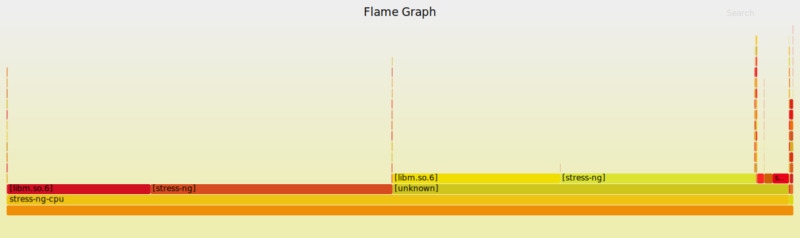

# Лабораторная работа №1


### cpu testing

выданные параметры: float80, float128

необходимо добиться максимальной производительности системы


в документации stress-ng написано:

> bogo ops number of iterations of the stressor during the run. This is metric of how much overall "work" has been achieved in bogo operations.  Do not use this as a reliable measure of throughput for benchmarking.

но, так как опираться нам больше не на что, то возьмем за основу то что есть, то есть показатель `bogo ops` а для получения заветных FLOPS будем умножать полученное значение на 1000, т.к. stress-ng приводит нагрузку батчами по 1000 итераций для параметров float80 и float128

параметры процессора, используемого в тесте можно получить с помощью `lscpu`. В моем случае это:

```
Architecture:            x86_64
  CPU op-mode(s):        32-bit, 64-bit
  Address sizes:         39 bits physical, 48 bits virtual
  Byte Order:            Little Endian
CPU(s):                  4
  On-line CPU(s) list:   0-3
Vendor ID:               GenuineIntel
  Model name:            Intel(R) Core(TM) i3-1005G1 CPU @ 1.20GHz
    CPU family:          6
    Model:               126
    Thread(s) per core:  2
    Core(s) per socket:  2
    Socket(s):           1
    Stepping:            5
    CPU(s) scaling MHz:  22%
    CPU max MHz:         3400.0000
    CPU min MHz:         400.0000
    BogoMIPS:            2381.00
    Flags:               fpu vme de pse tsc msr pae mce cx8 apic sep mtrr pge mca cmov pat 
                         pse36 clflush dts acpi mmx fxsr sse sse2 ss ht tm pbe syscall nx p
                         dpe1gb rdtscp lm constant_tsc art arch_perfmon pebs bts rep_good n
                         opl xtopology nonstop_tsc cpuid aperfmperf tsc_known_freq pni pclm
                         ulqdq dtes64 monitor ds_cpl vmx est tm2 ssse3 sdbg fma cx16 xtpr p
                         dcm pcid sse4_1 sse4_2 x2apic movbe popcnt tsc_deadline_timer aes 
                         xsave avx f16c rdrand lahf_lm abm 3dnowprefetch cpuid_fault epb in
                         vpcid_single ssbd ibrs ibpb stibp ibrs_enhanced tpr_shadow flexpri
                         ority ept vpid ept_ad fsgsbase tsc_adjust sgx bmi1 avx2 smep bmi2 
                         erms invpcid avx512f avx512dq rdseed adx smap avx512ifma clflushop
                         t intel_pt avx512cd sha_ni avx512bw avx512vl xsaveopt xsavec xgetb
                         v1 xsaves split_lock_detect dtherm ida arat pln pts hwp hwp_notify
                          hwp_act_window hwp_epp hwp_pkg_req vnmi avx512vbmi umip pku ospke
                          avx512_vbmi2 gfni vaes vpclmulqdq avx512_vnni avx512_bitalg avx51
                         2_vpopcntdq rdpid sgx_lc fsrm md_clear flush_l1d arch_capabilities
Virtualization features: 
  Virtualization:        VT-x
Caches (sum of all):     
  L1d:                   96 KiB (2 instances)
  L1i:                   64 KiB (2 instances)
  L2:                    1 MiB (2 instances)
  L3:                    4 MiB (1 instance)
NUMA:                    
  NUMA node(s):          1
  NUMA node0 CPU(s):     0-3
Vulnerabilities:         
  Gather data sampling:  Mitigation; Microcode
  Itlb multihit:         KVM: Mitigation: VMX disabled
  L1tf:                  Not affected
  Mds:                   Not affected
  Meltdown:              Not affected
  Mmio stale data:       Mitigation; Clear CPU buffers; SMT vulnerable
  Retbleed:              Mitigation; Enhanced IBRS
  Spec rstack overflow:  Not affected
  Spec store bypass:     Mitigation; Speculative Store Bypass disabled via prctl
  Spectre v1:            Mitigation; usercopy/swapgs barriers and __user pointer sanitizati
                         on
  Spectre v2:            Mitigation; Enhanced / Automatic IBRS, IBPB conditional, RSB filli
                         ng, PBRSB-eIBRS SW sequence
  Srbds:                 Mitigation; Microcode
  Tsx async abort:       Not affected
```

в процессе выполнения нам важно понимать, насколько разгоняется каждое из ядер процессора для мониторинга этого параметра можно использовать

```bash
> watch -n0.1 "grep Hz /proc/cpuinfo"
```

для мониторинга нагрузки на каждое их ядер процессора можно воспользоваться утилитой `htop` или стандартной `top`


для уменьшения влияния работающих программ на результаты тестов были "убиты" все не относящиеся к выполнению лабораторной работы процессы.

увидеть результаты массового убийства процессов можно с помощью утилиты `ps`, вызвав её с ключом -A. Полученный результат:

```
   PID TTY          TIME CMD
      1 ?        00:00:03 systemd
      2 ?        00:00:00 kthreadd
      3 ?        00:00:00 rcu_gp
      4 ?        00:00:00 rcu_par_gp
      5 ?        00:00:00 slub_flushwq
      6 ?        00:00:00 netns
      8 ?        00:00:00 kworker/0:0H-events_highpri
     11 ?        00:00:00 mm_percpu_wq
     13 ?        00:00:00 rcu_tasks_kthread
     14 ?        00:00:00 rcu_tasks_rude_kthread
     15 ?        00:00:00 rcu_tasks_trace_kthread
     16 ?        00:01:03 ksoftirqd/0
     17 ?        00:00:19 rcu_preempt
     18 ?        00:00:00 rcub/0
     19 ?        00:00:00 migration/0
     20 ?        00:00:00 idle_inject/0
     21 ?        00:00:00 cpuhp/0
     22 ?        00:00:00 cpuhp/1
     23 ?        00:00:00 idle_inject/1
     24 ?        00:00:00 migration/1
     25 ?        00:00:03 ksoftirqd/1
     27 ?        00:00:00 kworker/1:0H-events_highpri
     28 ?        00:00:00 cpuhp/2
     29 ?        00:00:00 idle_inject/2
     30 ?        00:00:00 migration/2
     31 ?        00:00:02 ksoftirqd/2
     33 ?        00:00:00 kworker/2:0H-events_highpri
     ....
     всякие системные процессы
     ....
  99541 pts/6    00:00:00 ps
```


#### Выполнение тестирования

запустим десятисекундный тест с float80 арифметикой для двух ядер:

```
> stress-ng --cpu 2 --cpu-method float80 --metrics --timeout 10

stress-ng: info:  [2565] setting to a 10 secs run per stressor
stress-ng: info:  [2565] dispatching hogs: 2 cpu
stress-ng: metrc: [2565] stressor       bogo ops real time  usr time  sys time   bogo ops/s     bogo ops/s CPU used per       RSS Max
stress-ng: metrc: [2565]                           (secs)    (secs)    (secs)   (real time) (usr+sys time) instance (%)          (KB)
stress-ng: metrc: [2565] cpu               33245     10.00     19.90      0.00      3324.39        1670.57        99.50          4896
stress-ng: info:  [2565] skipped: 0
stress-ng: info:  [2565] passed: 2: cpu (2)
stress-ng: info:  [2565] failed: 0
stress-ng: info:  [2565] metrics untrustworthy: 0
stress-ng: info:  [2565] successful run completed in 10.00 secs
```

Запустим тест несколько раз для того, чтобы убедиться в воспроизводимости резултата. Затем для сравнения 

В момент нагрузки имеем максимальную частоту процессора на всех ядрах в течение всего теста.

```
> watch -n1 "grep Hz /proc/cpuinfo"

Every 0.01s: grep Hz /proc/cpuinfo                       archlinux: Mon Oct 16 11:12:11 2023

model name      : Intel(R) Core(TM) i3-1005G1 CPU @ 1.20GHz
cpu MHz         : 3399.981
model name      : Intel(R) Core(TM) i3-1005G1 CPU @ 1.20GHz
cpu MHz         : 3400.000
model name      : Intel(R) Core(TM) i3-1005G1 CPU @ 1.20GHz
cpu MHz         : 3400.000
model name      : Intel(R) Core(TM) i3-1005G1 CPU @ 1.20GHz
cpu MHz         : 3400.000
```

В это время в `top` наблюдаем 

```
top - 11:28:53 up 30 min,  1 user,  load average: 0.98, 0.47, 0.33
Tasks: 157 total,   1 running, 156 sleeping,   0 stopped,   0 zombie
%Cpu0  :  0.3 us,  0.0 sy,  0.0 ni, 99.3 id,  0.0 wa,  0.0 hi,  0.3 si,  0.0 st 
%Cpu1  : 97.4 us,  0.0 sy,  0.0 ni,  3.6 id,  0.0 wa,  0.0 hi,  0.0 si,  0.0 st 
%Cpu2  : 97.3 us,  0.0 sy,  0.0 ni,  3.7 id,  0.0 wa,  0.0 hi,  0.0 si,  0.0 st 
%Cpu3  :  1.0 us,  0.3 sy,  0.0 ni, 98.7 id,  0.0 wa,  0.0 hi,  0.0 si,  0.0 st 
```

в результате выполнения эксперимента было утсановлено, что наибольшую производительность процессор показывает при использовании всех 4-х виртуальных ядер, но показатель производительности на одно ядро по сравнению с тестом на двух "воркерах" остается неизменным. При увеличении количества "воркеров" показатели производительно не растут, а параметр `CPU used per instance (%)"` уменьшается - связано это с тем, что большее количество источников просто разделяет между собой процессорное время на ядре.


```
> stress-ng --cpu 4 --cpu-method float80 --metrics --timeout 10
stress-ng: info:  [7023] setting to a 10 secs run per stressor
stress-ng: info:  [7023] dispatching hogs: 4 cpu
stress-ng: metrc: [7023] stressor       bogo ops real time  usr time  sys time   bogo ops/s     bogo ops/s CPU used per       RSS Max
stress-ng: metrc: [7023]                           (secs)    (secs)    (secs)   (real time) (usr+sys time) instance (%)          (KB)
stress-ng: metrc: [7023] cpu               48518     10.00     39.56      0.01      4851.63        1226.00        98.93          4892
stress-ng: info:  [7023] skipped: 0
stress-ng: info:  [7023] passed: 4: cpu (4)
stress-ng: info:  [7023] failed: 0
stress-ng: info:  [7023] metrics untrustworthy: 0
stress-ng: info:  [7023] successful run completed in 10.01 secs
```

для того, чтобы более подробно разобраться в том, куда тратится процессорное время и определить какие функции использует `stress-ng` для нагрузки CPU, обратимся к утилитам `perf` и `flamegraph`:

```
sudo perf record -F 99 -g stress-ng --cpu 4 --cpu-method float80 --metrics --timeout 10
sudo perf script | stackcollapse-perf.pl | flamegraph.pl > graph-float80-test.svg
```


видим, что большинство процессорного времени (а именно более 82%) занимает функция `libm.so.6`, также в явном виде можем увидеть функции работы с `float64` числами: `sincosf64x`, `sinf64x` и `cosf64x`. Что позволяет сделать предположение о том, что операции с `float80` реализованы через операции с меньшей разрядностью. 


аналогично для float128:

```bash
> stress-ng --cpu 4 --cpu-method float128 --metrics --timeout 10
stress-ng: info:  [7478] setting to a 10 secs run per stressor
stress-ng: info:  [7478] dispatching hogs: 4 cpu
stress-ng: metrc: [7478] stressor       bogo ops real time  usr time  sys time   bogo ops/s     bogo ops/s CPU used per       RSS Max
stress-ng: metrc: [7478]                           (secs)    (secs)    (secs)   (real time) (usr+sys time) instance (%)          (KB)
stress-ng: metrc: [7478] cpu               45571     10.00     39.74      0.01      4556.90        1146.29        99.38          5024
stress-ng: info:  [7478] skipped: 0
stress-ng: info:  [7478] passed: 4: cpu (4)
stress-ng: info:  [7478] failed: 0
stress-ng: info:  [7478] metrics untrustworthy: 0
stress-ng: info:  [7478] successful run completed in 10.00 secs
```


```
sudo perf record -F 99 -g stress-ng --cpu 4 --cpu-method float128 --metrics --timeout 10
sudo perf script | stackcollapse-perf.pl | flamegraph.pl > graph-float128-test.svg
```



на flamegraph получаем результат подобный тому, что получили при работе с `float80`.

### cache testing

из документации stress-ng:

> --l1cache N
                   start N workers that exercise the CPU level 1 cache with reads and writes. A cache aligned buffer that is twice the level 1 cache size is read and then written in level 1 cache set sized steps over each  level  1 \
                   cache set. This is designed to exercise cache block evictions. The bogo-op count measures the number of million cache lines touched.  Where possible, the level 1 cache geometry is determined from the kernel, how‐ \
                   ever, this is not possible on some architectures or kernels, so one may need to specify these manually. One can specify 3 out of the 4 cache geometric parameters, these are as follows: ....


для нахождения оптималььного значения параметра l1cache напишем простейший bash-скрипт:

```shell
#!/bin/sh
for i in {1..16..1}; do
    echo "run with l1cache=$i"
    a=`stress-ng --l1cache $i --metrics --timeout 2`
    echo "${a:214:405}"
done
```

Результат работы скрипта:
```
run with l1cache=1
stress-ng: metrc: [20285] stressor       bogo ops real time  usr time  sys time   bogo ops/s     bogo ops/s CPU used per       RSS Max
stress-ng: metrc: [20285]                           (secs)    (secs)    (secs)   (real time) (usr+sys time) instance (%)          (KB)
stress-ng: metrc: [20285] l1cache            1344      2.07      2.07      0.00       648.68         649.16        99.92          2852

run with l1cache=2
stress-ng: metrc: [20312] stressor       bogo ops real time  usr time  sys time   bogo ops/s     bogo ops/s CPU used per       RSS Max
stress-ng: metrc: [20312]                           (secs)    (secs)    (secs)   (real time) (usr+sys time) instance (%)          (KB)
stress-ng: metrc: [20312] l1cache            2304      2.08      4.16      0.00      1105.76         553.35        99.91          2724

run with l1cache=3
stress-ng: metrc: [20315] stressor       bogo ops real time  usr time  sys time   bogo ops/s     bogo ops/s CPU used per       RSS Max
stress-ng: metrc: [20315]                           (secs)    (secs)    (secs)   (real time) (usr+sys time) instance (%)          (KB)
stress-ng: metrc: [20315] l1cache            2112      2.10      6.26      0.01      1007.33         336.77        99.70          2724

run with l1cache=4
stress-ng: metrc: [20330] stressor       bogo ops real time  usr time  sys time   bogo ops/s     bogo ops/s CPU used per       RSS Max
stress-ng: metrc: [20330]                           (secs)    (secs)    (secs)   (real time) (usr+sys time) instance (%)          (KB)
stress-ng: metrc: [20330] l1cache            1536      2.07      8.22      0.00       742.69         186.83        99.38          2724

... подобные результаты


run with l1cache=16
stress-ng: metrc: [20668] stressor       bogo ops real time  usr time  sys time   bogo ops/s     bogo ops/s CPU used per       RSS Max
stress-ng: metrc: [20668]                           (secs)    (secs)    (secs)   (real time) (usr+sys time) instance (%)          (KB)
stress-ng: metrc: [20668] l1cache            2048      2.70     10.80      0.01       759.87         189.46        25.07          2724
```

наблюдаем аналогичную картину с размытием доли процессорного времени для каждого из воркеров при их увеличении выше 4х штук. Полученный результат (два воркера работают эффективнее четырех) можно объяснить тем, что у тестируемого процессора всего два ядра и, вероятно l1 кэша тоже всего два. При переключении контекста теряется информация в кэше и поэтому мы можем наблюдать деградацию показателей производительности при увеличении "воркеров".

лучшие результаты при тестирвоании кэша на пятисекундном отрезке полученные при использовании двух "воркеров":

```
> stress-ng --l1cache 2 --metrics --timeout 5
stress-ng: info:  [9325] setting to a 5 secs run per stressor
stress-ng: info:  [9325] dispatching hogs: 2 l1cache
stress-ng: info:  [9326] l1cache: l1cache: size: 48.0K, sets: 64, ways: 12, line size: 64 bytes
stress-ng: metrc: [9325] stressor       bogo ops real time  usr time  sys time   bogo ops/s     bogo ops/s CPU used per       RSS Max
stress-ng: metrc: [9325]                           (secs)    (secs)    (secs)   (real time) (usr+sys time) instance (%)          (KB)
stress-ng: metrc: [9325] l1cache            6400      5.07     10.14      0.00      1261.65         631.36        99.92          2720
stress-ng: info:  [9325] skipped: 0
stress-ng: info:  [9325] passed: 2: l1cache (2)
stress-ng: info:  [9325] failed: 0
stress-ng: info:  [9325] metrics untrustworthy: 0
stress-ng: info:  [9325] successful run completed in 5.09 secs
```

аналогично используем скрипт для поиска оптимального размера линии кэша

```shell
#!/bin/sh
for i in {1..16..1}; do
    echo "run with l1cache=$i"
    a=`stress-ng --l1cache 2 --l1cache-line-size $i --metrics --timeout 2`
    echo "${a:214:405}"
done
```

для большего охвата кэша во время теста оказалось эффективным уменьшить line-size до двух байтов. Результат для пятисекундного промежутка с профилированием:

```
sudo perf stat -B -e cache-references,cache-misses,cycles,instructions,branches,faults,migrations stress-ng --l1cache 2 --l1cache-line-size 2 --metrics --timeout 5
stress-ng: info:  [23440] setting to a 5 secs run per stressor
stress-ng: info:  [23440] dispatching hogs: 2 l1cache
stress-ng: info:  [23441] l1cache: l1cache: size: 48.0K, sets: 2048, ways: 12, line size: 2 bytes
stress-ng: metrc: [23440] stressor       bogo ops real time  usr time  sys time   bogo ops/s     bogo ops/s CPU used per       RSS Max
stress-ng: metrc: [23440]                           (secs)    (secs)    (secs)   (real time) (usr+sys time) instance (%)          (KB)
stress-ng: metrc: [23440] l1cache            8192      5.56     11.12      0.00      1472.13         736.84        99.90          2716
stress-ng: info:  [23440] skipped: 0
stress-ng: info:  [23440] passed: 2: l1cache (2)
stress-ng: info:  [23440] failed: 0
stress-ng: info:  [23440] metrics untrustworthy: 0
stress-ng: info:  [23440] successful run completed in 5.57 secs

 Performance counter stats for 'stress-ng --l1cache 2 --l1cache-line-size 2 --metrics --timeout 5':

         1,598,033      cache-references                                                      
           619,496      cache-misses                     #   38.77% of all cache refs         
    37,717,614,691      cycles                                                                
   131,183,116,574      instructions                     #    3.48  insn per cycle            
    32,788,603,630      branches                                                              
               848      faults                                                                
                55      migrations                                                            

       5.579686894 seconds time elapsed

      11.126315000 seconds user
       0.004825000 seconds sys

```

### IO test

для использования утилит типа `iotop` необходимо исопльзоавть sudo, т.к пользователям по-умолчанию не предоставляется исчерпываающая информация по файлам в файловой системе.


> Io-uring stressor \
            --io-uring N \
                   start N workers that perform iovec write and read I/O operations using the Linux io-uring interface. On each bogo-loop 1024 × 512 byte writes and 1024 × reads are performed on a temporary file.


`iotop` в "спокойном" состоянии - stress-ng выключен: 


```
Total DISK READ :       0.00 B/s | Total DISK WRITE :       0.00 B/s
Actual DISK READ:       0.00 B/s | Actual DISK WRITE:       0.00 B/s
```

запускаем нагрузку io-uring с 16 "воркеров" на 10 секунд:

```
stress-ng --io-uring 16 --metrics --timeout 10
```

`iotop` под нагрузкой 

```
Total DISK READ :       0.00 B/s | Total DISK WRITE :      54.78 M/s
Actual DISK READ:       0.00 B/s | Actual DISK WRITE:      60.79 M/s
```

делаем вывод, что нагрузка идет, собирать её будем с помощью `iostat`, а обрабатывать с помощью awk:

```shell
sudo iostat -d -k 1 nvme0n1 | awk '/nvme0n1/ {printf "Read: "$3", Write: "$4" \n"}'
```

запустив параллельно `stress-ng`, на выходе получаем:

```
Read: 614.55, Write: 3442.87 
Read: 0.00, Write: 0.00 
Read: 0.00, Write: 31820.00 
Read: 0.00, Write: 43332.00 
Read: 0.00, Write: 42824.00 
Read: 0.00, Write: 38068.00 
Read: 0.00, Write: 45024.00 
Read: 0.00, Write: 39572.00 
Read: 0.00, Write: 42444.00 
Read: 0.00, Write: 50544.00 
Read: 0.00, Write: 39084.00 
Read: 0.00, Write: 43564.00 
Read: 0.00, Write: 38140.00 
Read: 0.00, Write: 0.00 
```

преобрзауем к виду:

```
time Read Write
0 614.55 3442.87 
1 0.00 0.00 
2 0.00 31820.00 
3 0.00 43332.00 
4 0.00 42824.00 
5 0.00 38068.00 
6 0.00 45024.00 
7 0.00 39572.00 
8 0.00 42444.00 
9 0.00 50544.00 
10 0.00 39084.00 
11 0.00 43564.00 
12 0.00 38140.00 
13 0.00 0.00
```

помещаем в файл `16io-uring.csv` и строим по полученным данным график с помощью `gnuplot`:

```gnuplot
set key autotitle columnhead
 plot '16io-uring.csv' using 1:2 with points pointsize 2 pointtype 7 lt 1, \
'16io-uring.csv' using 1:3 with points pointsize 2 pointtype 7 lt 2
```

полученный график нагрузки на IO (по горизонтальой оси время в секундах):


--- 


Из документации stress-ng:

> --ioport N \
                   start N workers than perform bursts of 16 reads and 16 writes of ioport 0x80 (x86 Linux systems only).  I/O performed on x86 platforms on port 0x80 will cause delays on the CPU performing the I/O.

а значит, что мы не нагружаем диск, а только обращаемся к ioport 0x80, тем самым нагружаем только CPU.

результат выполнения НТ для 512 "воркеров":

```
> sudo stress-ng --ioport 512 --metrics --timeout 10
stress-ng: info:  [3821] setting to a 10 secs run per stressor
stress-ng: info:  [3821] dispatching hogs: 512 ioport
stress-ng: metrc: [3821] stressor       bogo ops real time  usr time  sys time   bogo ops/s     bogo ops/s CPU used per       RSS Max
stress-ng: metrc: [3821]                           (secs)    (secs)    (secs)   (real time) (usr+sys time) instance (%)          (KB)
stress-ng: metrc: [3821] ioport           104924     10.14     76.21      4.23     10352.38        1304.37         2.24          2584
stress-ng: metrc: [3821] miscellaneous metrics:
stress-ng: metrc: [3821] ioport            508164.69 nanosecs per inb(0x80) op (geometric mean of 355 instances)
stress-ng: metrc: [3821] ioport            473698.40 nanosecs per outb(0x80) op (geometric mean of 355 instances)
stress-ng: info:  [3821] skipped: 0
stress-ng: info:  [3821] passed: 355: ioport (355)
stress-ng: info:  [3821] failed: 0
stress-ng: info:  [3821] metrics untrustworthy: 0
stress-ng: info:  [3821] successful run completed in 21.13 secs
```


график нагрузки на IO не меняется, так как мы не проводим прямые операции чтения или записи.


### memory


Из документации stress-ng:

> zlib-mem-level L \
                   specify the reserved compression state memory for zlib.  Default is 8. \
                   Value \ 
                     1    minimum memory usage. \
                     9    maximum memory usage. \


переберём все значения параметра скриптом

```
#!/bin/sh
for i in {1..9..1}; do
    echo "run with zlib-mem-level=$i"
    a=`stress-ng --zlib 1 --zlib-mem-level $i --metrics --timeout 10`
    echo "$a"
done
```

полученный результат будем сравнивать по параментру `compression rate`, который получаем в ответе stress-ng:

```
un with zlib-mem-level=9
stress-ng: info:  [11938] setting to a 10 secs run per stressor
stress-ng: info:  [11938] dispatching hogs: 1 zlib
stress-ng: metrc: [11938] stressor       bogo ops real time  usr time  sys time   bogo ops/s     bogo ops/s CPU used per       RSS Max
stress-ng: metrc: [11938]                           (secs)    (secs)    (secs)   (real time) (usr+sys time) instance (%)          (KB)
stress-ng: metrc: [11938] zlib                386     10.02     10.17      0.01        38.54          37.92       101.63          3356
stress-ng: metrc: [11938] miscellaneous metrics:
stress-ng: metrc: [11938] zlib                  65.08 % compression ratio (geometric mean of 1 instances)
stress-ng: metrc: [11938] zlib                   2.45 MB/sec compression rate (geometric mean of 1 instances)
stress-ng: info:  [11938] skipped: 0
stress-ng: info:  [11938] passed: 1: zlib (1)
stress-ng: info:  [11938] failed: 0
stress-ng: info:  [11938] metrics untrustworthy: 0
stress-ng: info:  [11938] successful run completed in 10.02 secs
```

лучший результат получаем в тесте с максимальным ипользованием памяти (9). 

Так как алгоритм zlib невероятно популярен и много где используется, имеет смысл чуть подробнее рассмотреть тесты с ним.

загружается в основном процессор, а не память и поэтому имеет смысл построить flamegraph:

```sh
sudo perf record -F 99 -g stress-ng --zlib 4 --zlib-mem-level 9 --metrics --timeout 10
sudo perf script | stackcollapse-perf.pl | flamegraph.pl > graph-zlib-test.svg
```


замечаем, что программа тратит минимум времени на операции чтения и записи: 0.33% и 0.08% соответсвенно. Большинство времени проходит в libz.so. \
Промониторив через `top` загрузку памяти и процессора убеждаемся, что процесс с нашей нагрузкой не потрбляет больше `0.1%` памяти, но зато ест `100%` процессора.

---                   

Из документации stress-ng:

> --lockbus N \
                 star t  N  workers  that  rapidly lock and increment 64 bytes of randomly chosen memory from a
                   16MB mmap'd region (Intel x86 and ARM CPUs only).   This  will  cause  cacheline  misses  and
                   stalling of CPUs.


### network

Из документации stress-ng:

> --netlink-task N
                   start  N  workers  that  collect  task  statistics via the netlink taskstats interface.  This
                   stressor can only be run on Linux and requires CAP_NET_ADMIN capability.


воспользуемся скриптом для поиска оптимального значения параметра N:

```shell
#!/bin/sh
for i in {1..16..1}; do
    echo "run with netlink-task=$i"
    a=`stress-ng --netlink-task $i --metrics --timeout 2`
    echo "${a}"
done
```

Лучший результат получили для N=2.


> --netdev N
                   start N workers that exercise various netdevice ioctl commands across all the available  net‐
                   work   devices.   The  ioctls  exercised  by  this  stressor  are  as  follows:  SIOCGIFCONF,
                   SIOCGIFINDEX,  SIOCGIFNAME,   SIOCGIFFLAGS,   SIOCGIFADDR,   SIOCGIFNETMASK,   SIOCGIFMETRIC,
                   SIOCGIFMTU, SIOCGIFHWADDR, SIOCGIFMAP and SIOCGIFTXQLEN. See netdevice(7) for more details of
                   these ioctl commands.

аналогично поиску значения параметра netlink-task, воспользуемся 

```shell
#!/bin/sh
for i in {1..16..1}; do
    echo "run with netlink-task=$i"
    a=`stress-ng --netdev $i --metrics --timeout 2`
    echo "${a}"
done
```

лучшие результаты были получены при значении N=4

### pipe


Из документации stress-ng:

> --pipe-ops N
                   stop pipe stress workers after N bogo pipe write operations.

>   --sigpipe N
                   start N workers that repeatedly spawn off child process that exits before a parent  can  com‐
                   plete  a  pipe  write,  causing  a SIGPIPE signal.  The child process is either spawned using
                   clone(2) if it is available or use the slower fork(2) instead.

### sched


> --sched-runtime runtime
              select the runtime parameter for deadline scheduler (only on Linux). Default value  is  99999  (in
              nanoseconds).


> --schedpolicy N
              start  N  workers  that  set  the  worker  to  various  available  scheduling policies out of
              SCHED_OTHER, SCHED_BATCH, SCHED_IDLE, SCHED_FIFO, SCHED_RR and SCHED_DEADLINE.  For the  real
              time  scheduling policies a random sched priority is selected between the minimum and maximum
              scheduling priority settings.

